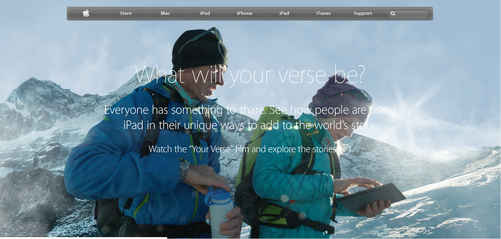

# BUILDING WITH BACKGROUNDS AND GRADIENTS

> This project consists of building a webpage using images as a background and adding gradients to elements. The goal is to make a clone of old an old version of the Apple website webpage.

## Built With

- HTML, CSS.

## Live Demo

[Live Demo Link](https://rawcdn.githack.com/abcussi/Building-with-Backgrounds-and-Gradients/90fe3d61abc02cd5623f239fb417169698245fff/index.html)

## Author

👤 **Angel Benjamin Cussi**

- Github: [@githubhandle](https://github.com/abcussi)
- Twitter: [@twitterhandle](https://twitter.com/thecussi)
- Linkedin: [linkedin](https://www.linkedin.com/in/angel-cussi-1b2310174/)

## 🤝 Contributing

Contributions, issues and feature requests are welcome!

Feel free to check the [issues page](issues/).

## Show your support

Give a ⭐️ if you like this project!

## Acknowledgments

- Hat tip to anyone whose code was used
- Inspiration
- etc

